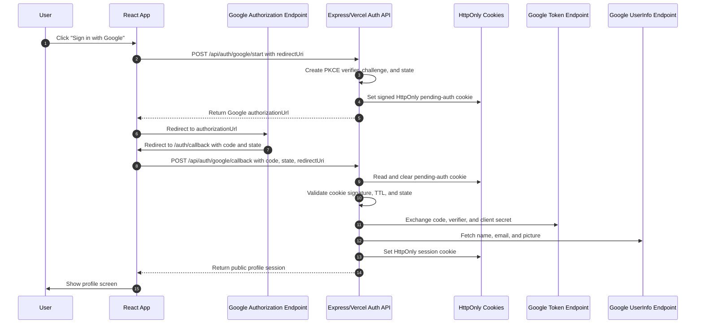

# Lavega Google SSO Test

A small React + TypeScript application that signs a user in with Google using OAuth 2.0 Authorization Code Flow with PKCE, fetches the Google profile, restores a valid HttpOnly cookie session on reload, and clears the session on logout.

## Tech Stack

- React 19 with functional components and hooks
- Vite
- TypeScript
- React Router
- Google OAuth 2.0 with PKCE
- Express backend-for-frontend for PKCE creation, Google token exchange, and session handling
- Vercel serverless functions for deployed API routes

## Login Flow



## Runtime Auth Endpoints

| Method | Endpoint | Purpose |
| --- | --- | --- |
| `POST` | `/api/auth/google/start` | Backend creates OAuth `state`, PKCE `code_verifier`, PKCE `code_challenge`, stores pending auth in a signed HttpOnly cookie, and returns Google `authorizationUrl`. |
| `POST` | `/api/auth/google/callback` | Backend validates `state`, reads `code_verifier` from the pending cookie, exchanges the Google authorization code for tokens, fetches the profile, and sets the session cookie. |
| `GET` | `/api/auth/session` | Restores a valid signed-in session from the HttpOnly cookie and refreshes the access token when possible. |
| `POST` | `/api/auth/logout` | Deletes the server session and clears session/pending-auth cookies. |

## Install Dependencies

If pnpm is not installed globally, enable it with Corepack first:

```bash
corepack enable pnpm
```

```bash
pnpm install
```

## Configure Google OAuth Credentials

1. Open [Google Cloud Console](https://console.cloud.google.com/).
2. Create or select a project.
3. Configure the OAuth consent screen.
4. Go to **APIs & Services > Credentials**.
5. Create an **OAuth client ID**.
6. Choose **Web application**.
7. Add this authorized JavaScript origin:

```text
http://localhost:5173
```

8. Add this authorized redirect URI:

```text
http://localhost:5173/auth/callback
```

For the deployed Vercel app, also add:

```text
https://test-lavega-lavega-test-rinto.vercel.app
```

and:

```text
https://test-lavega-lavega-test-rinto.vercel.app/auth/callback
```

9. Copy the generated client ID and client secret.

The client secret is used only by the local Express auth server. Never expose it in React components or browser code.

## Configure Environment Variables

Create a local `.env` file from the example:

```bash
cp .env.example .env
```

Then update the values:

```env
VITE_GOOGLE_CLIENT_ID=your-google-oauth-client-id.apps.googleusercontent.com
GOOGLE_CLIENT_SECRET=your-google-oauth-client-secret
VITE_GOOGLE_REDIRECT_URI=http://localhost:5173/auth/callback
VITE_GOOGLE_SCOPES=openid email profile
AUTH_SERVER_PORT=8787
```

`.env` is ignored by Git so credentials stay out of version control.

For Vercel, configure the same values in the Vercel project environment variables. Use this production redirect URI:

```env
VITE_GOOGLE_REDIRECT_URI=https://test-lavega-lavega-test-rinto.vercel.app/auth/callback
```

## Run Locally

```bash
pnpm dev
```

This starts both:

- Vite frontend on `http://localhost:5173`
- Express auth server on `http://localhost:8787`

Open:

```text
http://localhost:5173
```

## Test the Login Flow in the Browser

1. Start the dev server with `pnpm dev`.
2. Visit `http://localhost:5173`.
3. Click **Sign in with Google**.
4. Complete Google sign-in.
5. Confirm the callback redirects to the profile screen.
6. Verify that your name, email, and profile picture are displayed.
7. Refresh the browser and confirm the app restores the session when the token is still valid.
8. Click **Logout** and confirm the login screen appears again.

Error states to test:

- Cancel Google consent. The app returns to the login screen with a cancellation message.
- Clear or expire the `lavega_pending_auth` cookie before the callback. The backend rejects the response as expired or missing.
- Change the returned `state` query parameter manually. The app rejects the response as invalid.

## Deploy to Vercel

The app is deployed as a Vite frontend plus Vercel serverless API functions.

Important files:

- `vercel.json` routes React SPA pages to `index.html` while preserving `/api/*` routes.
- `api/auth/google/start.mjs`
- `api/auth/google/callback.mjs`
- `api/auth/session.mjs`
- `api/auth/logout.mjs`
- `server/index.mjs` exports the Express app for Vercel and only calls `app.listen()` locally.

Deploy command:

```bash
vercel deploy . --prod --scope lavega-test-rinto
```

Current production URL:

```text
https://test-lavega-lavega-test-rinto.vercel.app
```

## Build

```bash
pnpm build
```

## Run Unit Tests

```bash
pnpm test
```

## Security Notes and Known Limitations

- The app uses PKCE and validates the OAuth `state` value before exchanging the code.
- The frontend never uses or stores a Google client secret. The secret is read only by the local Express auth server.
- Tokens, authorization codes, refresh tokens, and secrets are never logged.
- Pending PKCE verifier and state are generated by the backend and stored in a signed HttpOnly cookie with a short TTL.
- Browser JavaScript never reads the PKCE verifier.
- The resulting signed-in state is restored through an HttpOnly, SameSite cookie. Browser JavaScript does not store access or refresh tokens.
- Sessions are stored in memory for this entrance-test app. Production should use a durable encrypted session store such as Redis, Vercel KV, DynamoDB, or a database-backed session strategy.
- Refresh-token handling is implemented server-side only when Google returns a refresh token.
- Google may require a fresh consent prompt before returning a refresh token.
- This app is intended for the entrance test flow, not as a complete production authentication system.
